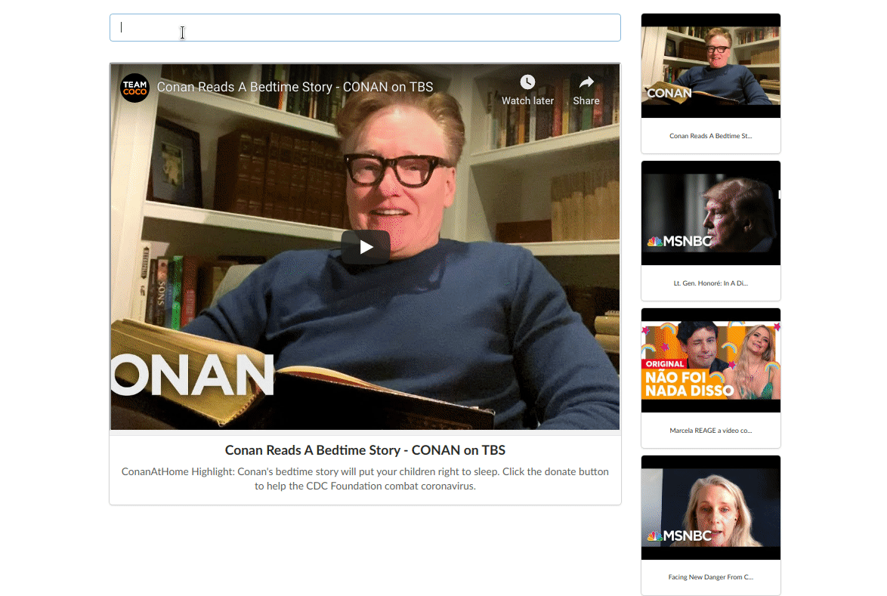

# Mini Youtube Viewer

This a mini youtube viewer inspired in one of the course's projects I took on [UDEMY - Modern React with Redux](https://www.udemy.com/course/react-redux/), the project in the couse was styled using [Bootstrap](https://getbootstrap.com/) but I decided to change it to use [Semantic-UI](https://semantic-ui.com/) instead, there was an issue to make the project responsive when resizing the screen, but this was fixed. It was build using [REACT](https://reactjs.org/) classes and simple function based components, but I am adapting it to use only [React Hooks](https://reactjs.org/docs/hooks-intro.html) in order 
to improve my knowledge about this subject. 


## Get it up an running

#### Create an .env file

- create an .env file into the root project folder** and set your [Youtube API KEY]

> .env

```
REACT_APP_API_KEY= <YOUTUBE_V3_API_KEY>
```

#### With Node and NPM Installed .

- Install the dependencies

```bash
npm install
```

- Execute the project
```bash
npm start
```


### The folowing is a preview of the app working



